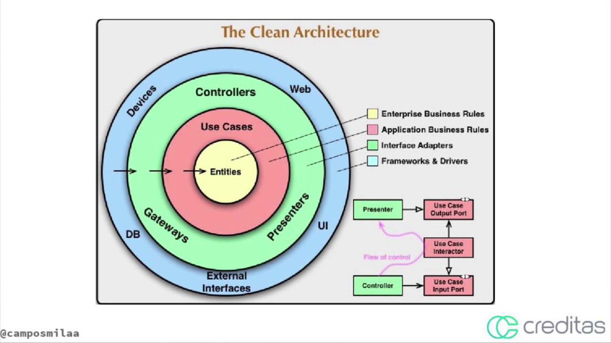

_"Salvar vidas e cuidar das pessoas porque elas não podem esperar nas filas da saúde."_
Conheça: www.drconsulta.com

## Objetivo

O teste é destinado para vaga de Desenvolvedor Back-end entendo como o candidato efetuou a solução e o raciocinio de criação

## Project - API

[]

Criar uma API REST para gerenciar um estacionamento de carros e motos.

#### Stack tecnológica

- NestJS [*]
- TypeOrm [*]
- Mysql [*]
- Swagger [(ainda falta implementar)]
- JWT [(ainda falta implementar)]

-[*] Cadastro de Usuarios
-[] Autenticacao
-[] Empresas
-[] Veiculos
-[] Dashbard

> ## Bibliotecas e Ferramentas

- NPM
- Typescript
- Git
- Docker
- Jest
- TypeOrm
- MySQL
- Sequelite
- SuperTest

> ## Features do Typescript

- POO Avançado
- Interface
- TypeAlias
- Namespace
- Utility Types
- Modularização de Paths
- Configurações
- Build
- Deploy
- Uso de Breakpoints

> ## Features de Testes

- Testes Unitários
- Testes de Integração
- Cobertura de Testes
- Test Doubles
- Mocks
- Stubs
- Spies
- Fakes

#### Cadastro de estabelecimento

Criar um cadastro da empresa com os seguintes campos:

- Nome;
- CNPJ;
- Endereço;
- Telefone;
- Quantidade de vagas para motos;
- Quantidade de vagas para carros.
- **Todos** os campos são de preenchimento obrigatório.

#### Cadastro de veículos

Criar um cadastro de veículos com os seguintes campos:

- Marca;
- Modelo;
- Cor;
- Placa;
- Tipo.
- **Todos** os campos são de preenchimento obrigatório.

#### Funcionalidades

- **Estabelecimento:** CRUD;
- **Veículos:** CRUD;
- **Controle de entrada e saída de veículos.**

#### Requisitos

- Controle JWT via Handshake
- Modelagem de dados;
- O retorno deverá ser em formato JSON;
- Requisições GET, POST, PUT ou DELETE, conforme a melhor prática;
- A persistência dos dados deverá ser em banco _relacional MYSQL_
- Criar README do projeto descrevendo as tecnologias utilizadas, chamadas dos serviços e configurações necessário para executar a aplicação.

#### Ganha mais pontos

- Sumário da quantidade de entrada e saída;
- Sumário da quantidade de entrada e saída de veículos por hora;
- Criação relatórios para visão ao dono do estabelecimento;
- Desenvolver utilizando TDD;

## DevOps (Diferencial)

Efetuar deploy da nossa API no ambiente do Google Cloud Platform utilizando os serviços

#### Serviços do GCP

- Container Registry (Subir a imagem docker)
- Cloud Run
